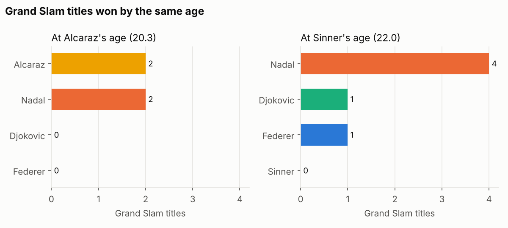
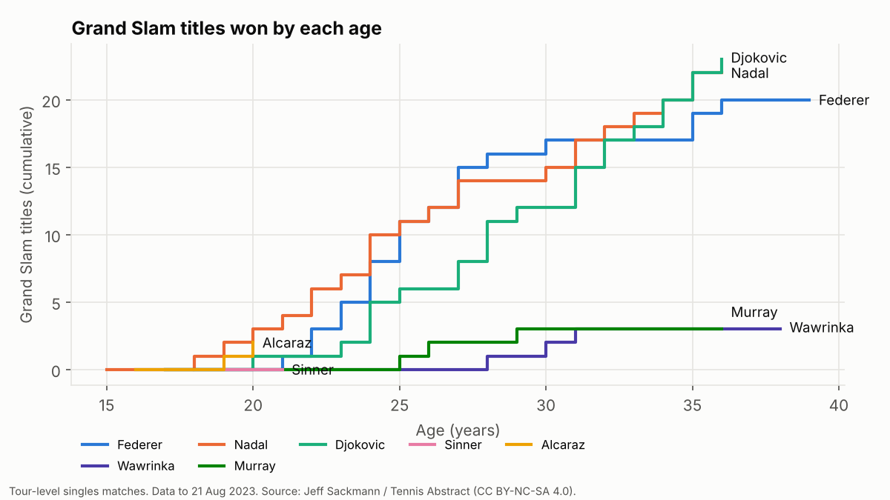
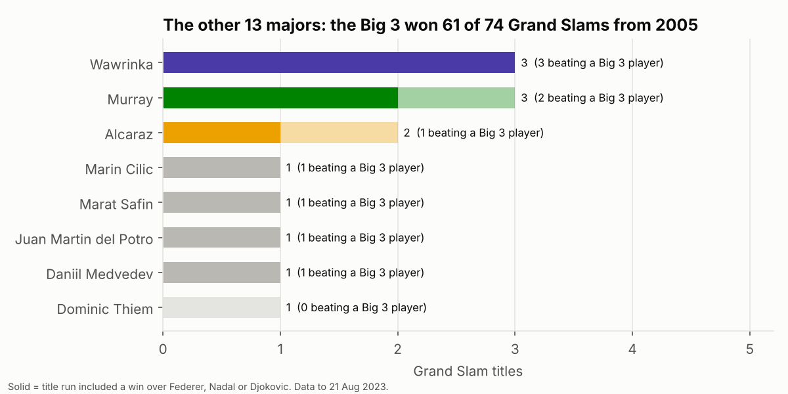
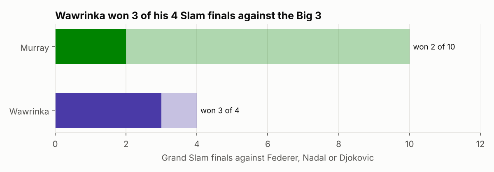
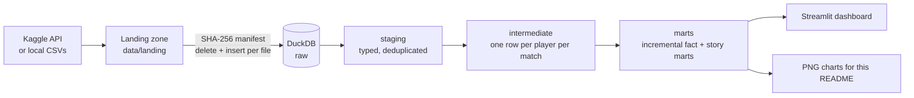

# Are Alcaraz and Sinner on Big 3 pace?

An end-to-end data pipeline on 34 seasons of ATP results (1990 – August 2023), from raw CSVs to a story-led dashboard.

It lines up every career **by age** rather than by season, so the new generation is compared with Federer, Nadal and Djokovic at the same point in their lives. A second section looks at the two players who kept winning majors during the Big 3 era: **Andy Murray** and **Stan Wawrinka**.



## What the data says

**Alcaraz is on Nadal's pace. Sinner, at the cut-off, was not yet.**

* At 20.3, Alcaraz had **2 Grand Slams**: as many as Nadal at that age, and two more than Federer or Djokovic. He had also spent 30 weeks at world No. 1, while none of the Big 3 had reached No. 1 by 20.
* At 22.0, Sinner had **no Slam yet** (data ends in August 2023). By that age Nadal had 4, and Federer and Djokovic 1 each. Sinner's tour-level win rate (71 %) sits between Federer's (66 %) and Djokovic's (75 %) at the same age.



**The other 13.** From 2005 to August 2023 the Big 3 won **61 of 74** Grand Slams. Only two other players won three: Murray and Wawrinka.

* Wawrinka beat a Big 3 player on the way to **all three** of his titles: Nadal and Djokovic at the 2014 Australian Open, Djokovic and Federer at the 2015 French Open, and Djokovic in the 2016 US Open final.
* He won **3 of his 4** Grand Slam finals against the Big 3. Murray, who had the bigger career overall, won 2 of 10.




More charts: [win rate by age](docs/img/03_win_pct.png) · [win rate vs top-10](docs/img/04_win_pct_vs_top10.png) · [weeks at No. 1](docs/img/05_cum_weeks_at_no1.png)

## Architecture



| Layer | Models | What happens there |
|---|---|---|
| **raw** | `raw.atp_matches`, `raw.atp_players`, `raw.atp_rankings`, `raw._manifest` | Files loaded as text, untouched, with lineage columns (`_source_file`, `_file_hash`, `_loaded_at`) |
| **staging** | `stg_atp__matches`, `stg_atp__players`, `stg_atp__rankings` | Types, surrogate keys, naming fixes, de-duplication rules |
| **intermediate** | `int_player_matches` | Each match unpivoted into a winner row and a loser row, with age at the match |
| **marts** | `dim_players`, `fct_player_matches` (incremental), `mart_age_curves`, `mart_pace_comparison`, `mart_big3_era_slams`, `mart_vs_big3_h2h`, `mart_slam_titles`, `mart_no1_weeks` | Business logic lives here, not in the dashboard |

Row counts on the full run: 108,236 matches → 216,472 player-match rows; 3.17 M weekly ranking rows; 61,153 players.

## Design decisions

**Idempotent at every step.** Running the pipeline twice changes nothing.

* *Ingestion*: each source file is a partition. Its SHA-256 is stored in `raw._manifest`. Unchanged files are skipped; a changed file has its partition deleted and re-inserted in one transaction, so corrections replace data instead of duplicating it.
* *Transformation*: `fct_player_matches` is an incremental model with a unique key (`delete+insert`). Each run reprocesses the trailing 12 months to pick up late corrections, and `--full-refresh` rebuilds from scratch after logic changes.
* Both behaviours are covered by tests (`tests/test_pipeline.py`).

**Raw stays raw.** Everything lands as text and is typed in staging, so one bad value in a source file can never break a load.

**Tests guard the data, not just the code.** 23 dbt tests (uniqueness, not-null, accepted values, relationships) plus custom checks: every match must unpivot into exactly one win and one loss, and every player-age row in the age curves must be unique.

**One question, answered in the models.** The dashboard only reads marts. Every number in this README comes from a dbt model.

## Data quality findings

The tests flagged real issues in the source on the first full run. Each is handled explicitly in staging and documented in the SQL:

| Issue | Rows | Rule applied |
|---|---|---|
| Two player IDs reused for two different people each | 4 player rows | Keep one row per ID (lower-tier players, no effect on results) |
| Same player listed twice in the same ranking week with different ranks | 479 player-weeks, mostly 2019–2023 | Keep the best rank for that week |
| Tournament name casing changes across years ("Us Open" / "US Open") | 2020–2023 | Normalised in staging |
| Weeks at No. 1 come from weekly snapshots | – | Lower than official ATP counts (the 2020 ranking freeze and some missing weeks are not in the files), so the chart is labelled as snapshots |

## Run it

```bash
pip install -r requirements.txt

# Option 1: pull the data with the Kaggle API (token in the environment, never in the repo)
export KAGGLE_API_TOKEN=...        # or ~/.kaggle/kaggle.json
make kaggle

# Option 2: CSVs you already have
python -m pipeline.run --source-dir path/to/csvs

make test         # idempotency + dbt build on a small fixture
make dashboard    # interactive version: streamlit run dashboard/app.py
```

The full run takes about 30 seconds on a laptop. Everything is stored in one DuckDB file (`data/warehouse.duckdb`), which you can open with any SQL client.

## Stack

Python · DuckDB · dbt (dbt-duckdb) · Streamlit · Plotly · Matplotlib · pytest · GitHub Actions

## Data and licence

Match, player and ranking data by Jeff Sackmann / Tennis Abstract, distributed on Kaggle as [ATP Tennis Rankings, Results, and Stats (1968–2023)](https://www.kaggle.com/datasets/warcoder/atp-tennis-rankings-results-and-stats1968-2023), licensed **CC BY-NC-SA 4.0**. This project uses it for non-commercial analysis. Matches are tour-level singles; retirements and walkovers are excluded from win rates.

---

Built by [Rafael Marchini Piva](https://en.malt.es/profile/rafaelmarchinipiva): data engineer and sports-business MBA, Madrid.
